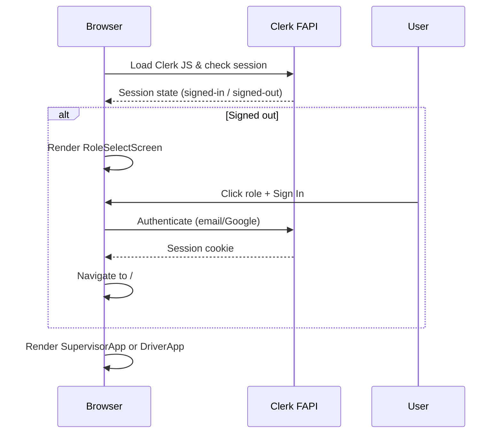
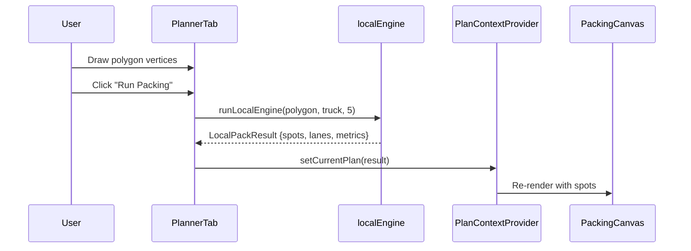
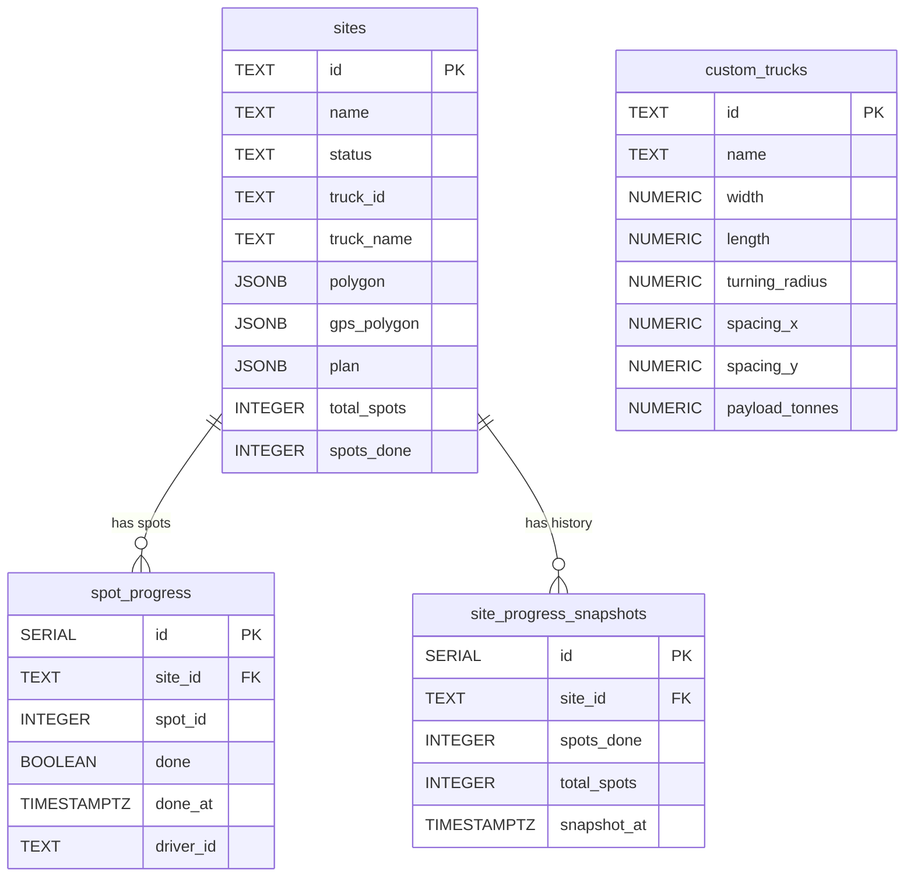
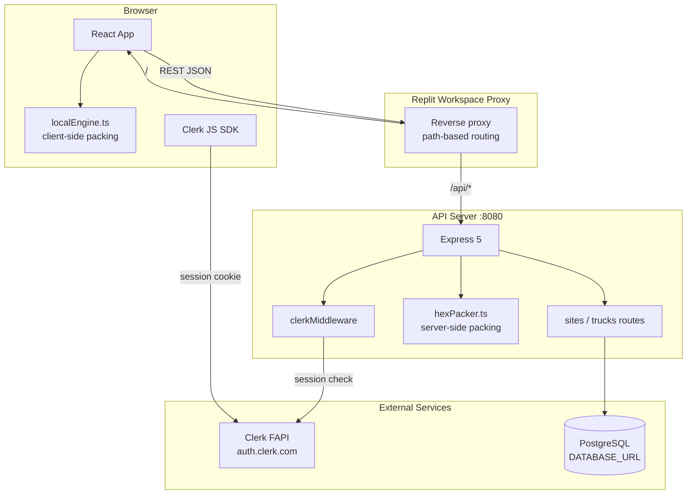
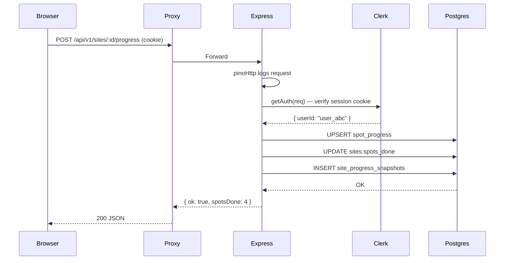
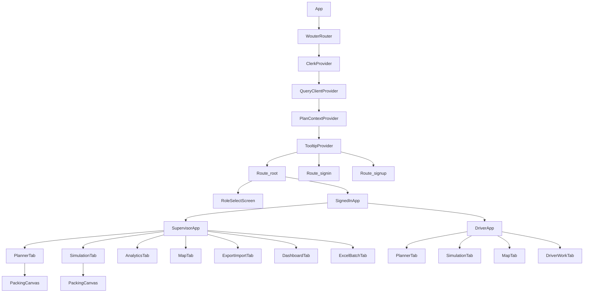
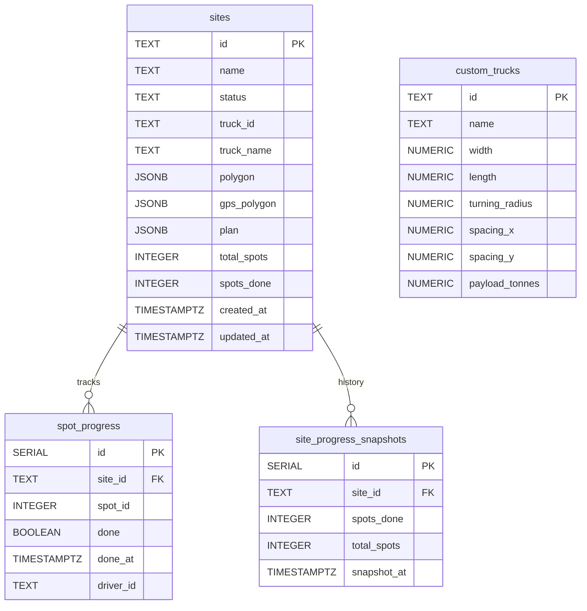
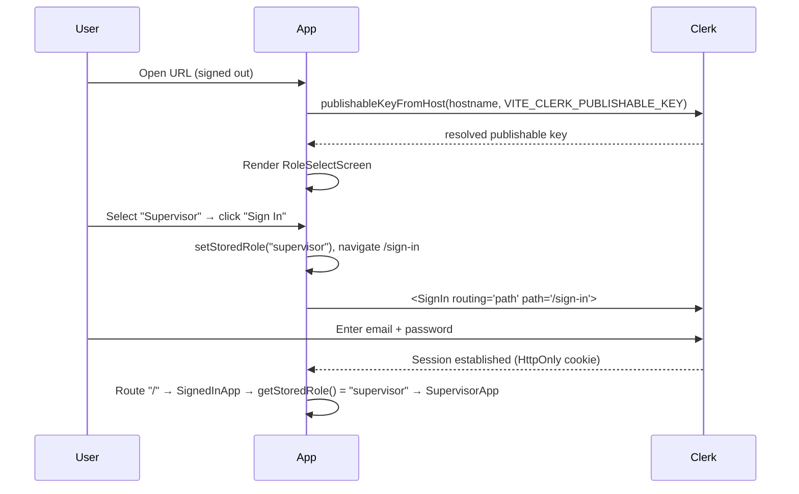

# Optimal Dump Packing

> **Industrial planning and simulation platform for autonomous mining haul trucks.**
> Uses adaptive polygon spot-point packing (hexagonal close packing + rotation optimisation + turning-radius inset buffering) to improve dump density 2.4× over current autonomous systems.

---

## Table of Contents

1. [Project Overview](#1-project-overview)
2. [Complete Workflow](#2-complete-workflow)
3. [Frontend Documentation](#3-frontend-documentation)
4. [API Documentation](#4-api-documentation)
5. [Backend Documentation](#5-backend-documentation)
6. [Algorithms](#6-algorithms)
7. [Data Flow](#7-data-flow)
8. [State Management](#8-state-management)
9. [Database Documentation](#9-database-documentation)
10. [Folder Structure](#10-folder-structure)
11. [Function-by-Function Explanation](#11-function-by-function-explanation)
12. [Execution Flow](#12-execution-flow)
13. [Error Handling](#13-error-handling)
14. [Configuration](#14-configuration)
15. [Security](#15-security)
16. [Performance](#16-performance)
17. [Complete Project Diagrams](#17-complete-project-diagrams)
18. [Developer Guide](#18-developer-guide)
19. [Maintenance Guide](#19-maintenance-guide)
20. [Code Annotation Reference](#20-code-annotation-reference)
21. [Final Summary](#21-final-summary)

---

## 1. Project Overview

### Problem Statement

Autonomous mining haul trucks use fixed rectangular dump-spot grids with no polygon-aware spatial planning. This results in:

- Large unused dump regions at polygon edges and corners
- Frequent truck re-spotting (pulling out and repositioning)
- Poor dump density (~41 % space utilisation)
- Dozer reshape interventions required daily
- Edge overshoot safety events

### Purpose

Optimal Dump Packing computes the densest safe dumping layout inside **any** irregularly shaped dump polygon using three combined techniques:

1. **Hexagonal close packing** — the mathematically densest possible 2-D circle packing (90.7 % theoretical efficiency vs 78.5 % for square grids)
2. **Rotation optimisation** — sweeps 0–60° (the full hex symmetry range) to find the angle that fits the most spots inside a given polygon
3. **Turning-radius inset buffering** — shrinks the polygon inward by the truck's minimum turning radius so that every spot is reachable without a multi-point turn

### Real-World Use Case

A mine site supervisor:

1. Draws or GPS-captures the dump zone boundary on a map
2. Selects the truck model (CAT 793, CAT 797F, CAT 789D, Komatsu 930E, or a custom profile)
3. Clicks **Pack** — the algorithm fills the polygon with optimal hex spots in under 200 ms
4. Optionally runs **Fill Edge Gaps** to squeeze additional spots into boundary voids
5. Sets an entry point and exit point; the system re-orders spots **farthest-first** so deep spots are claimed before shallow ones, preventing traffic congestion
6. Exports the plan as JSON or pushes it to the Dashboard
7. Drivers open the **Work tab** and mark each spot done in the correct dispatch order

### Features

| Feature | Description |
|---|---|
| Planner Tab | Draw arbitrary polygon, select truck, run hex packing, fill gaps, click spots for metadata, set entry/exit |
| Simulation Tab | Farthest-first dispatch animation with speed control and per-lane progress |
| Analytics Tab | Dual-mode live metrics (Planner or Map/GPS), fill-time estimates, improvement chart |
| Map / GPS Tab | Leaflet map, GPS polygon vertex input, spot overlay, entry/exit click, plan import |
| Export / Import Tab | Download plan JSON (with GPS polygon, entry/exit if available) and re-import |
| Dashboard | Real-time site list, 1-second demo fill, 10-second polling alerts, toast on 100 %, Chart/History toggle, progress persisted to DB |
| Driver Work Tab | Live site list, spot canvas, **farthest-first dispatch order**, mark-done per spot |
| Batch Excel Tab | Upload multi-sheet Excel, 60° sweep + gap-fill per sheet, checkbox site selection, export results |
| Auth | Clerk email/password + Google sign-in; role-based UI (Supervisor / Driver) |
| PostgreSQL | 4 tables; schema auto-created on startup; all operations through raw SQL |

### Architecture Overview

```
Browser (React + Vite)
  │  Clerk session cookie (auth)
  │  REST JSON over HTTPS
  ▼
API Server (Express 5, port 8080)
  ├── Clerk proxy middleware  →  Clerk FAPI
  ├── /api/v1/pack           →  hexPacker.ts  (server-side packing)
  ├── /api/v1/trucks         →  PostgreSQL (custom_trucks)
  ├── /api/v1/sites          →  PostgreSQL (sites, spot_progress, snapshots)
  └── /api/v1/analysis       →  benchmark & density-gap data
```

The frontend also has a **local engine** (`localEngine.ts`) that runs the same hex-packing algorithm client-side in the browser for instant preview (no network round-trip). The server-side engine is used for final export and batch processing.

### Technology Stack

| Layer | Technology |
|---|---|
| Package management | pnpm workspaces (monorepo) |
| Runtime | Node.js 24 |
| Language | TypeScript 5.9 (strict) |
| Frontend framework | React 19 + Vite 7 |
| Styling | Tailwind CSS v4 + shadcn/ui components |
| Animation | framer-motion |
| Charts | recharts |
| Map | Leaflet (dynamically imported) |
| Router | wouter |
| Auth | Clerk (Replit-managed tenant) |
| API server | Express 5 |
| Logging | pino + pino-http |
| Database | PostgreSQL (Replit-managed) |
| Bundler (server) | esbuild (via custom `build.mjs`) |
| Excel parsing | SheetJS (xlsx) |

---

## 2. Complete Workflow

### End-to-End User Journey

#### Step 1 — Landing

User opens the app URL. The React app boots, Clerk initialises from `VITE_CLERK_PUBLISHABLE_KEY`, and renders:

- **Signed-out**: `RoleSelectScreen` — choose Supervisor or Driver, then Sign In / Create Account
- **Signed-in**: `SignedInApp` — reads role from `localStorage.dump_packing_role` and renders either `SupervisorApp` or `DriverApp`



#### Step 2 — Supervisor: Draw and Pack

1. User clicks **Planner** tab → `PlannerTab` renders
2. User clicks on the canvas to draw polygon vertices. Canvas state is local to `PlannerTab`.
3. User clicks **Close Polygon** — polygon is closed and stored in `currentPolygon` via `PlanContextProvider`
4. User selects a truck profile from the sidebar
5. User clicks **Run Packing**:
   - Client-side: `runLocalEngine(polygon, truck, rotStep)` runs synchronously in the browser (< 50 ms for typical polygons) and stores the result in `currentPlan` via `PlanContextProvider`
   - The canvas re-renders with coloured hex spots
6. Optional: user clicks **Fill Edge Gaps** → `fillGaps(inset, spots, truck)` runs and adds gap-fill spots
7. User sets entry/exit point by clicking canvas in "entry mode" or "exit mode"
8. Entry/exit points are stored in `entryPoint` / `exitPoint` in `PlanContextProvider`



#### Step 3 — Supervisor: Simulate Dispatch

1. User clicks **Simulation** tab → `SimulationTab` renders
2. User clicks **From Planner** to use the drawn plan, or selects a preset polygon
3. User clicks **Play** → `start()` fires an interval
4. Each interval tick: next spot in `dispatchOrder` is highlighted (amber, glowing), then marked done (green)
5. `dispatchOrder` is computed by `sortSpotsByDispatch(spots, entryPoint)` — farthest spots first
6. Progress bar updates; lane-level progress updates per tick

#### Step 4 — Supervisor: Dashboard + Demo

1. User saves a plan from Export/Import or Batch Excel → `POST /api/v1/sites`
2. Dashboard polls `GET /api/v1/sites` every 10 seconds
3. User clicks **Demo Fill** → starts a 1-second interval that calls `PATCH /api/v1/sites/:id/progress` for each spot
4. Each progress update triggers a DB snapshot insert in `site_progress_snapshots`
5. At 100 % completion, a toast fires and the site card shows "Completed"

#### Step 5 — Driver: Fill Spots

1. Driver signs in (role = driver), sees `DriverApp` with **Work** tab
2. `DriverWorkTab` fetches `GET /api/v1/sites` and filters `status = 'running'`
3. Driver clicks a site → `GET /api/v1/sites/:id` returns full site detail + spot progress
4. `spots` are sorted **farthest-from-entry first** using `sortSpotsByDispatch` when an entry point exists
5. `currentSpot = pendingSpots[0]` — the deepest unfilled spot
6. Driver clicks **Mark Done** → `POST /api/v1/sites/:id/progress` → DB updates `spot_progress` and `spots_done` on `sites` → inserts a snapshot
7. UI optimistically updates, next spot highlighted

---

## 3. Frontend Documentation

### Directory: `artifacts/dump-packing/src/`

```
src/
├── App.tsx                   # Root — Clerk, role routing, tab shells
├── index.tsx                 # React DOM mount point
├── index.css                 # Tailwind v4 entrypoint + Clerk layer order
├── engine/
│   └── localEngine.ts        # Client-side hex packing (mirrors server algorithm)
├── lib/
│   ├── api.ts                # Typed fetch wrapper for all API calls
│   ├── planContext.tsx        # React context for shared plan state
│   └── utils.ts              # shadcn cn() utility
└── components/
    ├── PlannerTab.tsx         # Draw polygon, run packing, set entry/exit
    ├── SimulationTab.tsx      # Animated farthest-first dispatch playback
    ├── AnalyticsTab.tsx       # Live metrics + improvement chart
    ├── MapTab.tsx             # Leaflet map + GPS polygon input
    ├── ExportImportTab.tsx    # Download / upload plan JSON
    ├── DashboardTab.tsx       # Site management + demo fill + progress history
    ├── DriverWorkTab.tsx      # Driver's spot-filling interface
    ├── ExcelBatchTab.tsx      # Multi-site batch Excel upload/export
    ├── PackingCanvas.tsx      # Canvas-based polygon + spot renderer
    └── ui/                   # shadcn/ui primitives (Button, Card, Toast…)
```

---

### `App.tsx`

**Purpose**: Root component. Owns Clerk provider, role management, tab chrome, and route structure.

**Key State**:
- `role` — read from `localStorage.dump_packing_role` on mount; written when user picks a role on the landing screen
- No React state for role — deliberately uses `localStorage` so it survives HMR without re-rendering the Clerk provider

**Exports**: `default App`

**Key constants**:
```typescript
const clerkPubKey = publishableKeyFromHost(window.location.hostname, import.meta.env.VITE_CLERK_PUBLISHABLE_KEY);
const clerkProxyUrl = import.meta.env.VITE_CLERK_PROXY_URL;  // empty in dev, auto-set in prod
const basePath = import.meta.env.BASE_URL.replace(/\/$/, "");
```

**Role system**:
- `getStoredRole()` — reads `localStorage.dump_packing_role`, returns `"supervisor" | "driver" | null`
- `setStoredRole(role)` — writes to localStorage
- `RoleSelectScreen` — renders two role cards; when user chooses a role and clicks Sign In/Up, stores role and navigates to `/sign-in` or `/sign-up`
- `SignedInApp` — reads stored role and renders `SupervisorApp` or `DriverApp`

**Supervisor tabs**: Planner, Simulation, Analytics, Map/GPS, Export/Import, Dashboard, Batch Excel

**Driver tabs**: Planner, Simulation, Map/GPS, Work

**Component tree**:
```
WouterRouter (base={basePath})
└── ClerkProvider (publishableKey, proxyUrl, appearance)
    └── QueryClientProvider
        └── PlanContextProvider
            └── TooltipProvider
                ├── Route "/" → RoleSelectScreen (signed-out) | SignedInApp (signed-in)
                ├── Route "/sign-in/*?" → SignInPage
                └── Route "/sign-up/*?" → SignUpPage
```

---

### `engine/localEngine.ts`

**Purpose**: Pure TypeScript hex-packing implementation that runs entirely in the browser. No network calls. Mirrors the server-side `hexPacker.ts` so the Planner tab gives instant feedback.

**Exports**:

| Export | Type | Description |
|---|---|---|
| `Pt` | type | `{x: number; y: number}` — local-coordinate point |
| `SpotLocal` | interface | Single packed spot with position, lane, sequence, rotation |
| `LaneLocal` | interface | A lane (column of spots) with its spot IDs and approach angle |
| `LocalPackResult` | interface | Full packing result: spots, lanes, polygon, inset, metrics, entry/exit |
| `centroid` | function | Arithmetic centroid of a polygon |
| `pip` | function | Point-in-polygon test (ray casting) |
| `insetPoly` | function | Shrinks a polygon inward by a given distance |
| `bbox` | function | Bounding box of a polygon |
| `projectToNearestEdge` | function | Snaps a point to the nearest polygon edge |
| `sortSpotsByDispatch` | function | Sorts spots farthest-from-entry first |
| `fillGaps` | function | Second-pass gap-fill for boundary voids |
| `runAtAngle` | function | Packs at one specific angle (used for rotation sweep animation) |
| `runLocalEngine` | function | Full optimal packing: sweeps 0–60°, picks best angle, builds spots + lanes |
| `DEFAULT_TRUCKS` | const | 3 built-in truck profiles (CAT 793, 797F, 789D) |

---

### `lib/planContext.tsx`

**Purpose**: React Context that holds all shared plan state across tabs. This avoids prop-drilling between the 7+ tabs that all need access to the current polygon, packing result, entry/exit points, and custom trucks.

**State owned**:

| State variable | Type | Who writes | Who reads |
|---|---|---|---|
| `currentPlan` | `LocalPackResult \| null` | PlannerTab | SimulationTab, AnalyticsTab, ExportImportTab |
| `currentPolygon` | `{pts, closed} \| null` | PlannerTab | — |
| `entryPoint` | `Pt \| null` | PlannerTab | SimulationTab, AnalyticsTab, ExportImportTab |
| `exitPoint` | `Pt \| null` | PlannerTab | SimulationTab, ExportImportTab |
| `selectedTruck` | `TruckConfig \| null` | PlannerTab | AnalyticsTab |
| `mapPlan` | `LocalPackResult \| null` | MapTab | AnalyticsTab, ExportImportTab |
| `mapEntryPoint` | `Pt \| null` | MapTab | AnalyticsTab |
| `mapExitPoint` | `Pt \| null` | MapTab | ExportImportTab |
| `mapGpsPts` | `GpsPt[]` | MapTab | ExportImportTab |
| `customTrucks` | `TruckConfig[]` | PlannerTab, SimulationTab | All truck selectors |

---

### `lib/api.ts`

**Purpose**: Typed fetch wrapper for all API calls. Attaches `credentials: "include"` so Clerk session cookies are sent automatically.

**How it works**:
- `apiFetch(path, options)` — prepends `BASE_URL` (from Vite env), attaches JSON headers, throws on non-OK responses
- Exports `api.trucks.*` and `api.sites.*` namespaces

**Auth**: Cookie-based (Clerk session cookie). No token headers needed.

---

### `components/PackingCanvas.tsx`

**Purpose**: Canvas-based renderer for the polygon + inset + spots + lanes + entry/exit markers. Used by Planner, Simulation, and Driver tabs.

**Key props**:

| Prop | Type | Description |
|---|---|---|
| `polygon` | `Pt[]` | Outer polygon vertices |
| `insetPolygon` | `Pt[]` | Inset polygon (where trucks actually go) |
| `spots` | `SpotLocal[]` | All packed spots |
| `lanes` | `LaneLocal[]` | Lane groupings |
| `completedSpotIds` | `Set<number>` | Spots marked done (green) |
| `activeSpotId` | `number \| null` | Currently active spot (amber glow) |
| `entryPoint` | `Pt \| null` | Green "E" marker |
| `exitPoint` | `Pt \| null` | Red "X" marker |
| `simulationMode` | `boolean` | Disables click interaction |
| `readOnly` | `boolean` | Disables editing |

**Rendering logic**:
- Computes a `scale` to fit the polygon bounding box into the canvas with padding
- Draws outer polygon (amber border), inset polygon (dim border), lane regions (colour-coded), spots (circles), then markers

**When it re-renders**: Any time `spots`, `completedSpotIds`, `activeSpotId`, `entryPoint`, or `exitPoint` changes (via `useEffect` with a `useRef` canvas)

---

### `components/PlannerTab.tsx`

**Purpose**: Primary planning workspace. Allows drawing a polygon on a canvas, selecting a truck, running hex packing, filling gaps, and setting entry/exit points.

**Key state (local)**:
- `drawPts` — vertices being drawn
- `isClosed` — whether polygon is closed
- `plan` — current `LocalPackResult`
- `entryMode / exitMode` — click mode flags
- `showRotationSweep` — whether to show the 0–60° sweep chart
- `gapFilled` — whether gap-fill has been run

**Key interactions**:
- Canvas click → add vertex (open polygon) or set entry/exit (if in entry/exit mode)
- **Run Packing** → `runLocalEngine(pts, truck, 5)` → `setCurrentPlan` + `setPlan`
- **Fill Edge Gaps** → `fillGaps(inset, spots, truck)` → merges gap spots into plan
- **Reset** → clears all state
- **Load Preset** → loads one of 5 preset polygons

---

### `components/SimulationTab.tsx`

**Purpose**: Animated playback of the farthest-first dispatch order. Shows trucks filling spots one by one.

**Dispatch order**: Built by `sortSpotsByDispatch(plan.spots, entryPoint)` if an entry point exists, otherwise by `globalSequence`.

**Animation loop**:
```typescript
intervalRef.current = setInterval(() => {
  const spot = dispatchOrder[step];
  setActiveId(spot.id);                         // amber glow
  setTimeout(() => {
    setCompletedIds(prev => new Set([...prev, spot.id]));  // turn green
    setActiveId(null);
  }, activeDuration);
  step++;
}, cycleDuration);
```

**Speed**: 1×, 2×, 4× — changes `cycleDuration = 700/speed` and `activeDuration = 500/speed`

---

### `components/DashboardTab.tsx`

**Purpose**: Supervisor's live site management dashboard. Shows all sites, their fill progress, allows demo fill, history, and status management.

**Key features**:
- Polls `GET /api/v1/sites` every 10 seconds
- **Demo Fill**: starts a `setInterval` at 1 second, calling `POST /api/v1/sites/:id/progress` sequentially through all spots
- **Toast on 100%**: fires when `spots_done === total_spots`
- **History toggle**: shows sparkline chart from `site_progress_snapshots` or a scrollable list
- **Alerts**: any site with `spots_done / total_spots < 0.1` after 60 seconds triggers an amber alert

---

### `components/DriverWorkTab.tsx`

**Purpose**: Driver's task interface. Shows assigned (running) sites, the current spot to fill, and GPS coordinates.

**Dispatch order fix**: When a plan has an `entryPoint`, spots are sorted farthest-first using `sortSpotsByDispatch` before finding `pendingSpots[0]`. This matches the SimulationTab's dispatch logic.

```typescript
const spots = useMemo(() => {
  const entryPt = selectedSite?.plan?.entryPoint ?? null;
  if (entryPt) return sortSpotsByDispatch(rawSpots, entryPt);
  return [...rawSpots].sort((a, b) => a.globalSequence - b.globalSequence);
}, [rawSpots, selectedSite?.plan?.entryPoint]);
```

**GPS display**: Converts local-coordinate spots to GPS using the GPS polygon centroid as origin (equirectangular projection).

---

### `components/ExcelBatchTab.tsx`

**Purpose**: Supervisor batch workflow — upload a multi-sheet Excel, compute packing for every sheet, select which sites to push to Dashboard.

**Excel format expected** (one sheet per site):
```
Site Name:   Pit A – Bench 3
Truck:       CAT 793
Vertices:
  lat, lng
  lat, lng
  ...
Entry:       lat, lng
```

**Processing flow**:
1. `xlsx.read(buffer)` → parse sheets
2. For each sheet: extract name, truck, vertices, entry, exit
3. `runLocalEngine(localPoly, truck, 5)` → pack
4. `fillGaps(inset, spots, truck)` → gap-fill
5. Results shown in a table; supervisor checks sites to import
6. **Push Selected** → `POST /api/v1/sites` for each checked site

---

## 4. API Documentation

Base URL: `/api/v1` (all routes under the Express `/api` prefix)

All routes except `/v1/pack/presets` and `/v1/analysis/*` require a valid Clerk session cookie.

---

### `GET /api/v1/pack/presets`

**Purpose**: Returns built-in truck profiles and simulation polygons (no auth required — public reference data).

**Response**:
```json
{
  "truckProfiles": [ { "id": "cat-793", "name": "CAT 793", ... } ],
  "simulationPolygons": [ { "id": "rectangle-large", "name": "...", "polygon": [...] } ]
}
```

---

### `POST /api/v1/pack`

**Purpose**: Run server-side hex packing on a local-coordinate polygon.

**Request body**:
```json
{
  "polygon": [{"x": 0, "y": 0}, ...],
  "truckProfileId": "cat-793",
  "customTruck": null,
  "ingressAngle": 0,
  "rotationStep": 5
}
```

**Validation**: `polygon` must be an array of ≥ 3 `{x, y}` points. `truckProfileId` must resolve to a known preset or `customTruck` must have an `id`.

**Business logic**:
1. `insetPolygon(polygon, truck.turningRadius)` — shrink polygon
2. `runPackingWithRotation(inset, polygon, truck, rotationStep)` — sweep 0–59°, pick best angle
3. `computeSquareGridCount(inset, ...)` — baseline for improvement %
4. Build metrics, return full `PackingResult`

**Response**:
```json
{
  "spots": [...],
  "lanes": [...],
  "polygon": [...],
  "insetPolygon": [...],
  "bestRotation": 15,
  "rotationScores": [{"angle": 0, "spotCount": 47}, ...],
  "metrics": {
    "spotCount": 52,
    "squareGridCount": 42,
    "improvementPercent": 23.8,
    "utilizationEfficiency": 0.84,
    "hexPackEfficiency": 0.9069,
    "squarePackEfficiency": 0.7854,
    "insetArea": 24300,
    "totalArea": 30000
  },
  "truckProfile": {...},
  "generatedAt": "2026-06-12T..."
}
```

**Status codes**: `200 OK`, `400 Bad Request` (invalid polygon or truck), `500 Internal Server Error`

---

### `POST /api/v1/pack/gps`

**Purpose**: Same as `/api/v1/pack` but accepts GPS coordinates. Converts to local metres internally using `gpsToLocal()`.

**Request body**:
```json
{
  "gpsPolygon": [{"lat": -27.123, "lng": 151.456}, ...],
  "truckProfileId": "cat-793"
}
```

**Conversion**: Uses equirectangular projection with the first vertex as origin. Accuracy sufficient for dump zones (< 5 km across).

---

### `POST /api/v1/pack/export`

**Purpose**: Wraps a plan in a versioned export envelope with filename and timestamp.

**Request body**: `{ "plan": <PackingResult>, "format": "generic-json" }`

**Response**: `{ "filename": "dump-plan-cat-793-2026-06-12T....json", "data": {...}, "generatedAt": "..." }`

---

### `GET /api/v1/trucks`  *(auth required)*

**Purpose**: List all custom trucks from `custom_trucks` table.

**Response**: Array of truck objects with camelCase keys (converted from snake_case DB columns).

---

### `POST /api/v1/trucks`  *(auth required)*

**Purpose**: Create or update a custom truck (upsert on `id`).

**Request body**: `{ id, name, width, length, turningRadius, spacingX, spacingY, payloadTonnes }`

**Validation**: `id` and `name` are required.

---

### `DELETE /api/v1/trucks/:id`  *(auth required)*

**Purpose**: Remove a custom truck by ID.

---

### `GET /api/v1/sites`  *(auth required)*

**Purpose**: List all sites (summary columns only — no `plan` JSONB blob).

**Response**: Array of `{ id, name, status, truck_id, truck_name, total_spots, spots_done, created_at, updated_at }`

**Ordered by**: `created_at DESC`

---

### `GET /api/v1/sites/:id`  *(auth required)*

**Purpose**: Full site detail including plan blob, spot progress, and snapshot history.

**Response**:
```json
{
  "id": "site-1714000000000",
  "name": "Pit A – Bench 3",
  "status": "running",
  "plan": { ...full LocalPackResult... },
  "spotProgress": [
    { "spot_id": 0, "done": true, "done_at": "...", "driver_id": "user_..." }
  ],
  "progressHistory": [
    { "spots_done": 1, "total_spots": 52, "snapshot_at": "..." }
  ]
}
```

---

### `POST /api/v1/sites`  *(auth required)*

**Purpose**: Create or upsert a site plan (on conflict by `id`, update everything except `spots_done`).

**Request body**: `{ id, name, truckId, truckName, polygon, gpsPolygon, plan }`

**DB operation**:
```sql
INSERT INTO sites (id, name, status, truck_id, truck_name, polygon, gps_polygon, plan, total_spots, spots_done)
VALUES ($1,$2,'running',$3,$4,$5,$6,$7,$8,0)
ON CONFLICT (id) DO UPDATE SET ...
```

---

### `PATCH /api/v1/sites/:id/status`  *(auth required)*

**Purpose**: Set site status to `'running'` or `'completed'`. Reopening (`'running'`) clears all spot progress.

**Request body**: `{ "status": "running" | "completed" }`

---

### `DELETE /api/v1/sites/:id`  *(auth required)*

**Purpose**: Delete site and cascade-delete all spot progress and snapshots.

---

### `POST /api/v1/sites/:id/progress`  *(auth required)*

**Purpose**: Mark a single spot done or undone. Side effects:
1. Upserts `spot_progress` row
2. Recounts all done spots → updates `sites.spots_done`
3. Inserts a row in `site_progress_snapshots`

**Request body**: `{ "spotId": 3, "done": true, "driverId": "user_abc123" }`

**Response**: `{ "ok": true, "spotsDone": 4 }`

---

### `GET /api/v1/analysis/benchmark`

**Purpose**: Run the packing algorithm across 3 polygons × 3 trucks (9 scenarios) and return improvement statistics.

**Response**:
```json
{
  "scenarios": [ { "polygonName": "...", "truckId": "cat-793", "hexSpots": 52, "squareSpots": 42, "improvementPercent": 23.8, "bestRotation": 15 } ],
  "summary": { "avgImprovementPercent": 18.2, "maxImprovementPercent": 34.1, "testedTrucks": ["cat-793", ...] }
}
```

---

### `GET /api/v1/analysis/density-gap`

**Purpose**: Returns static research KPIs comparing autonomous vs optimised dump spacing.

---

## 5. Backend Documentation

### `artifacts/api-server/`

```
src/
├── index.ts                    # Entry point: init DB, then listen
├── app.ts                      # Express app: middleware, routes
├── middlewares/
│   └── clerkProxyMiddleware.ts # Proxies Clerk FAPI requests through /api/__clerk
├── routes/
│   ├── index.ts                # Route aggregator
│   ├── health.ts               # GET /api/healthz
│   ├── pack.ts                 # POST /api/v1/pack, /pack/gps, /pack/export; GET /pack/presets
│   ├── analysis.ts             # GET /api/v1/analysis/benchmark, /density-gap
│   ├── trucks.ts               # CRUD /api/v1/trucks
│   └── sites.ts                # CRUD /api/v1/sites + progress
└── lib/
    ├── db.ts                   # pg Pool + initDb() (CREATE TABLE IF NOT EXISTS)
    ├── geometry.ts             # Point math: polygon area, inset, GPS→local, pip, rotate
    ├── hexPacker.ts            # Hex grid generation, rotation sweep, lane building
    ├── truckPresets.ts         # 4 built-in truck profiles + 5 preset polygons
    └── logger.ts               # pino singleton logger
```

---

### `src/index.ts`

**Purpose**: Boot sequence — validates `PORT` env var, runs `initDb()`, then starts the HTTP server.

**Boot order**:
```
initDb()  →  create tables if needed
  ↓
app.listen(port)
  ↓
logger.info "Server listening"
```

If `initDb()` throws, process exits with code 1 (never starts accepting connections).

---

### `src/app.ts`

**Purpose**: Assembles the Express app with all middleware in the correct order.

**Middleware order** (critical — must not reorder):
1. `pinoHttp` — structured request logging
2. `clerkProxyMiddleware` at `CLERK_PROXY_PATH` — must be before body parsers (streams raw bytes)
3. `cors` — credentials + wildcard origin
4. `express.json({ limit: "20mb" })` — 20 MB limit handles large plan JSONs with many spots
5. `express.urlencoded` — form data
6. `clerkMiddleware` — attaches auth state to `req`; resolves publishable key from hostname
7. `router` at `/api`

---

### `lib/db.ts`

**Purpose**: pg connection pool + `initDb()` schema bootstrap.

**`initDb()`**: Runs `CREATE TABLE IF NOT EXISTS` for all 4 tables and 2 indexes in a single transaction block. Safe to call on every restart — idempotent.

Tables created: `custom_trucks`, `sites`, `spot_progress`, `site_progress_snapshots`

---

### `lib/geometry.ts`

**Purpose**: All pure polygon math used by the packing algorithm.

| Function | Purpose |
|---|---|
| `polygonArea(pts)` | Shoelace formula — signed area magnitude |
| `ensureCCW(pts)` | Reverses polygon if clockwise (needed for correct inset normals) |
| `centroid(pts)` | Arithmetic average of all vertices |
| `rotatePoint(p, angle, origin)` | Rotate point around origin by angle (radians) |
| `rotatePolygon(pts, angleDeg)` | Rotate all polygon vertices |
| `pointInPolygon(p, poly)` | Ray-casting PIP test |
| `polygonBBox(pts)` | Bounding box `{minX, minY, maxX, maxY}` |
| `insetPolygon(pts, dist)` | Shrink polygon inward by `dist` metres |
| `gpsToLocal(coords)` | GPS `{lat,lng}[]` → local metres from first vertex |

---

### `lib/hexPacker.ts`

**Purpose**: Server-side hex packing engine. Generates the hex grid at a given rotation, filters to inset polygon, builds `SpotPoint` objects, groups into lanes, assigns global sequence via round-robin interleave.

**Key functions**:

`generateHexGrid(insetPoly, spacingX, spacingY, rotationDeg)`:
- Expands bounding box by 2 × spacing as padding
- Iterates rows with `rowHeight = spacingY × √3/2`
- Every even row is offset by `spacingX/2` (hex stagger)
- Each candidate point is rotated around the polygon centroid
- Points outside `insetPoly` are filtered

`runPackingWithRotation(insetPoly, originalPoly, truck, rotationStep, ingressAngle)`:
- Sweeps `angle = 0, rotationStep, 2×rotationStep, ... < 60`
- Picks angle with highest valid point count
- Calls `buildSpots` then `buildLanes`

`buildLanes(spots)`:
- Groups spots by `laneId` (X position bucket)
- Sorts each lane by Y descending (back to front)
- Assigns `sequenceInLane` and `globalSequence` via round-robin interleave across lanes

---

## 6. Algorithms

### Hex Close Packing

**Problem**: Pack the maximum number of circular truck footprints into an irregular polygon.

**Why hex?** Hexagonal close packing achieves π/(2√3) ≈ 90.69 % area coverage, the highest possible for equal circles in 2-D. Square grids achieve π/4 ≈ 78.54 %. The difference compounds as polygon area grows.

**Step-by-step**:
1. Compute row height `h = spacingY × √3/2` (equilateral triangle height)
2. Start at `y = bbox.minY - padding`; increment `y += h` each row
3. Each row: `x` starts at `bbox.minX - padding + offset` (offset = `spacingX/2` for odd rows)
4. Each candidate `(x, y)` is rotated by `−angleDeg` around the polygon centroid
5. Keep the point if `pointInPolygon(rotated, insetPoly)` returns true

**Visualisation**:
```
Row 0: ○   ○   ○   ○   (x = 0, 13.5, 27, ...)
Row 1:   ○   ○   ○     (x = 6.75, 20.25, ...)  offset = spacingX/2
Row 2: ○   ○   ○   ○
```

**Complexity**: O(rows × cols) where rows = polygon_height/rowHeight and cols = polygon_width/spacingX. For a 200 × 150 m polygon with 13.5 m spacing: ~11 rows × 15 cols = 165 candidates, filtered to ~52 valid spots. Time: < 2 ms per angle.

---

### Rotation Optimisation

**Problem**: The optimal hex grid angle depends on polygon shape. A rectangle fits more spots when the grid aligns with its long axis.

**Why 0–60° only?** Hex grids have 60° rotational symmetry — rotating 60° produces an identical layout. Scanning beyond 60° repeats already-seen configurations.

**Step-by-step**:
1. For `angle = 0, 5, 10, ..., 55` (12 evaluations with default step = 5):
   - Run `generateHexGrid(inset, spacingX, spacingY, angle)`
   - Count valid points
2. Return angle with the highest count

**Example**: A trapezoidal polygon might score:
```
0°: 47 spots   15°: 52 spots ← best   30°: 49 spots   45°: 44 spots
```

**Alternative**: Could use golden-section search in 0–60° range for O(log n) angle evaluations. Not implemented — 12 evaluations is already < 20 ms total.

---

### Turning-Radius Inset

**Problem**: Autonomous trucks cannot park arbitrarily close to a polygon edge — they need enough clearance to approach, dump, and exit without exceeding their minimum turning radius.

**Why inset?** Rather than rejecting spots within a radius of each edge (slow), the entire polygon is shrunk inward by `truck.turningRadius` metres. The inset polygon then defines the valid region — all points inside are guaranteed to have the required clearance.

**Algorithm** (`insetPolygon`):
1. Ensure polygon is counter-clockwise (`ensureCCW`)
2. For each edge `(A, B)`:
   - Compute the inward-pointing normal (perpendicular, magnitude = 1, pointing toward polygon interior)
   - Offset edge by `dist × normal`: new edge `A' = A + normal × dist`
3. For each pair of adjacent offset edges: find their intersection point — this is the inset vertex
4. If resulting area < 1 m², return empty polygon (too small for any spots)

**Edge case**: Concave polygon vertices can cause offset edges to cross, producing a "self-intersecting" inset. The intersection-point approach handles this correctly.

---

### Farthest-First Dispatch

**Problem**: If trucks fill spots nearest to the entry point first, returning trucks block incoming trucks heading to far spots, causing traffic deadlock at busy sites.

**Solution**: Sort spots by Euclidean distance from `entryPoint`, descending. Trucks go deep first — when they exit, they pass through the partially filled zone heading outward, never blocking inbound trucks.

**Implementation** (`sortSpotsByDispatch`):
```typescript
return [...spots]
  .sort((a, b) =>
    Math.hypot(b.x - entryPt.x, b.y - entryPt.y) -
    Math.hypot(a.x - entryPt.x, a.y - entryPt.y)
  )
  .map((s, i) => ({ ...s, globalSequence: i }));
```

**Complexity**: O(n log n) sort. For n ≤ 500 spots: < 1 ms.

---

### Gap Fill

**Problem**: Hex grid misses acute corners and irregular boundary regions.

**Algorithm** (`fillGaps`):
1. Scan the inset polygon bounding box at a fine step (`step = 0.46 × spacingX`)
2. For each candidate point inside the inset polygon:
   - Reject if closer than `0.88 × spacingX` to any existing spot
   - Reject if closer than `0.88 × spacingX` to any already-accepted gap-fill point
   - Otherwise accept
3. Return accepted gap-fill points as new spots (marked `zoneId=1, laneId=-1`)

**Why 0.46 and 0.88?** Tuned empirically: 0.46 gives enough granularity to find true gaps; 0.88 prevents the gap-fill spots from being too close to existing hex spots while still being dense enough to use the space.

---

## 7. Data Flow

```mermaid
flowchart TD
    A[User draws polygon in PlannerTab] -->|pts array| B[runLocalEngine]
    B -->|LocalPackResult| C[PlanContextProvider: setCurrentPlan]
    C -->|plan prop| D[PackingCanvas: renders spots]
    D -->|Click entry/exit| E[PlanContextProvider: setEntryPoint/setExitPoint]
    E -->|dispatch order| F[SimulationTab: sortSpotsByDispatch]
    F -->|sorted spots| G[Animation loop]

    A2[User in ExcelBatchTab uploads Excel] -->|xlsx parse| H[runLocalEngine per sheet]
    H -->|LocalPackResult| I[POST /api/v1/sites]
    I -->|SQL INSERT| J[(PostgreSQL: sites)]
    J -->|site list| K[DashboardTab: GET /api/v1/sites]
    K -->|sites array| L[React state: sites]
    L --> M[Site card renders]

    M2[Driver clicks Mark Done] -->|POST /api/v1/sites/:id/progress| N[sites.ts route]
    N -->|UPSERT spot_progress| O[(PostgreSQL: spot_progress)]
    N -->|UPDATE sites.spots_done| P[(PostgreSQL: sites)]
    N -->|INSERT snapshot| Q[(PostgreSQL: site_progress_snapshots)]
    N -->|{ok, spotsDone}| R[DriverWorkTab: optimistic UI update]
```

---

## 8. State Management

### Global State (`PlanContextProvider`)

All tabs read from and write to the shared `PlanContextProvider`. There is no Redux, Zustand, or other store — React Context is sufficient given the low update frequency (packing runs once per user action, not continuously).

**Update propagation**: React re-renders all consumers when any context value changes. Because `setCurrentPlan` is called only after a user-triggered pack, there is no performance issue.

### Local State (per component)

| Component | Local state | Why local? |
|---|---|---|
| PlannerTab | `drawPts`, `isClosed`, `entryMode`, `exitMode` | Only used by this tab |
| SimulationTab | `dispatchOrder`, `completedIds`, `activeId`, `playing`, `speed`, `currentStep` | Animation-specific |
| DashboardTab | `sites`, `selectedSite`, `demoRunning`, `showHistory` | Polling + UI selection |
| DriverWorkTab | `sites`, `selectedSite`, `marking`, `blink` | Driver-specific state |

### Server State (React Query)

React Query (`@tanstack/react-query`) is configured with `staleTime: 30000` and `retry: 1`. Currently only the PlannerTab uses the generated hooks (for truck presets). Most data fetching in Dashboard and Driver tabs is done with manual `useEffect` + `api.*` calls to support optimistic updates.

---

## 9. Database Documentation

### Schema

#### `custom_trucks`
```sql
CREATE TABLE custom_trucks (
  id              TEXT        PRIMARY KEY,           -- client-generated: "custom-1714000000000"
  name            TEXT        NOT NULL,
  width           NUMERIC     NOT NULL,              -- metres
  length          NUMERIC     NOT NULL,              -- metres
  turning_radius  NUMERIC     NOT NULL,              -- metres = inset distance
  spacing_x       NUMERIC     NOT NULL,              -- hex grid horizontal spacing
  spacing_y       NUMERIC     NOT NULL,              -- hex grid vertical spacing
  payload_tonnes  NUMERIC     NOT NULL,
  created_at      TIMESTAMPTZ NOT NULL DEFAULT now(),
  updated_at      TIMESTAMPTZ NOT NULL DEFAULT now()
);
```

#### `sites`
```sql
CREATE TABLE sites (
  id           TEXT     PRIMARY KEY,
  name         TEXT     NOT NULL,
  status       TEXT     NOT NULL DEFAULT 'running',  -- 'running' | 'completed'
  truck_id     TEXT     NOT NULL DEFAULT '',
  truck_name   TEXT     NOT NULL DEFAULT '',
  polygon      JSONB    NOT NULL DEFAULT '[]',        -- [{x,y}] local metres
  gps_polygon  JSONB,                                 -- [{lat,lng}] nullable
  plan         JSONB    NOT NULL DEFAULT '{}',        -- full LocalPackResult
  total_spots  INTEGER  NOT NULL DEFAULT 0,
  spots_done   INTEGER  NOT NULL DEFAULT 0,
  created_at   TIMESTAMPTZ NOT NULL DEFAULT now(),
  updated_at   TIMESTAMPTZ NOT NULL DEFAULT now()
);
```

#### `spot_progress`
```sql
CREATE TABLE spot_progress (
  id        SERIAL      PRIMARY KEY,
  site_id   TEXT        NOT NULL REFERENCES sites(id) ON DELETE CASCADE,
  spot_id   INTEGER     NOT NULL,
  done      BOOLEAN     NOT NULL DEFAULT false,
  done_at   TIMESTAMPTZ,
  driver_id TEXT,
  UNIQUE (site_id, spot_id)
);
CREATE INDEX idx_spot_progress_site_id ON spot_progress (site_id);
```

#### `site_progress_snapshots`
```sql
CREATE TABLE site_progress_snapshots (
  id          SERIAL      PRIMARY KEY,
  site_id     TEXT        NOT NULL REFERENCES sites(id) ON DELETE CASCADE,
  spots_done  INTEGER     NOT NULL,
  total_spots INTEGER     NOT NULL,
  snapshot_at TIMESTAMPTZ NOT NULL DEFAULT now()
);
CREATE INDEX idx_site_progress_snapshots_site_id ON site_progress_snapshots (site_id);
```

### Relationships



### Key Queries

**List sites (fast — no plan blob)**:
```sql
SELECT id, name, status, truck_id, truck_name, total_spots, spots_done, created_at, updated_at
FROM sites ORDER BY created_at DESC;
```

**Update spot progress**:
```sql
INSERT INTO spot_progress (site_id, spot_id, done, done_at, driver_id)
VALUES ($1, $2, $3, $4, $5)
ON CONFLICT (site_id, spot_id)
DO UPDATE SET done=EXCLUDED.done, done_at=EXCLUDED.done_at, driver_id=EXCLUDED.driver_id;

UPDATE sites SET spots_done = (
  SELECT COUNT(*) FROM spot_progress WHERE site_id=$1 AND done=true
), updated_at=NOW()
WHERE id=$1;

INSERT INTO site_progress_snapshots (site_id, spots_done, total_spots)
VALUES ($1, $2, $3);
```

**Optimisation strategies**:
- `plan` JSONB column is excluded from `GET /api/v1/sites` (list) to keep response size small — only fetched on `GET /api/v1/sites/:id`
- Indexes on `site_id` in both child tables make per-site queries O(log n)
- `spots_done` is denormalised on `sites` to avoid a COUNT query on every list call

---

## 10. Folder Structure

```
workspace/
├── pnpm-workspace.yaml          # Package discovery + catalog version pins
├── tsconfig.base.json           # Shared strict TS defaults
├── tsconfig.json                # Root solution file (lib packages only)
├── package.json                 # Root dev tooling (typescript, prettier)
├── database.txt                 # DB schema documentation
│
├── lib/
│   ├── api-spec/
│   │   └── openapi.yaml         # OpenAPI 3.1 spec (source of truth for API contract)
│   └── api-client-react/
│       └── src/generated/api.ts # Orval-generated React Query hooks (run codegen after spec changes)
│
├── artifacts/
│   ├── api-server/              # Express 5 API server
│   │   ├── build.mjs            # esbuild script: bundles src/ → dist/index.mjs
│   │   ├── package.json
│   │   ├── tsconfig.json
│   │   └── src/
│   │       ├── index.ts         # Entry: PORT validation, initDb(), app.listen()
│   │       ├── app.ts           # Express app + middleware stack
│   │       ├── middlewares/
│   │       │   └── clerkProxyMiddleware.ts
│   │       ├── routes/
│   │       │   ├── index.ts     # Route aggregator
│   │       │   ├── health.ts    # GET /api/healthz
│   │       │   ├── pack.ts      # Packing routes
│   │       │   ├── analysis.ts  # Benchmark + density-gap
│   │       │   ├── trucks.ts    # Custom truck CRUD
│   │       │   └── sites.ts     # Site + progress CRUD
│   │       └── lib/
│   │           ├── db.ts        # pg pool + initDb()
│   │           ├── geometry.ts  # Polygon math
│   │           ├── hexPacker.ts # Hex grid + lane builder
│   │           ├── truckPresets.ts # Built-in trucks + polygons
│   │           └── logger.ts    # pino singleton
│   │
│   ├── dump-packing/            # React + Vite frontend
│   │   ├── index.html
│   │   ├── vite.config.ts       # Vite: PORT, BASE_PATH, Tailwind v4 plugin
│   │   ├── package.json
│   │   ├── tsconfig.json
│   │   └── src/
│   │       ├── index.tsx        # React DOM mount
│   │       ├── index.css        # Tailwind + Clerk layer order
│   │       ├── App.tsx          # Root: Clerk, roles, tab chrome
│   │       ├── engine/
│   │       │   └── localEngine.ts  # Client-side hex packing (matches server)
│   │       ├── lib/
│   │       │   ├── api.ts       # Fetch wrapper
│   │       │   ├── planContext.tsx  # Shared plan state context
│   │       │   └── utils.ts     # cn() utility
│   │       └── components/
│   │           ├── PlannerTab.tsx
│   │           ├── SimulationTab.tsx
│   │           ├── AnalyticsTab.tsx
│   │           ├── MapTab.tsx
│   │           ├── ExportImportTab.tsx
│   │           ├── DashboardTab.tsx
│   │           ├── DriverWorkTab.tsx
│   │           ├── ExcelBatchTab.tsx
│   │           ├── PackingCanvas.tsx
│   │           └── ui/          # shadcn/ui components
│   │
│   └── mockup-sandbox/          # Canvas design preview server (internal tooling)
│
└── scripts/
    └── src/                     # Utility scripts
```

---

## 11. Function-by-Function Explanation

### `runLocalEngine(polygon, truck, rotStep = 5)`

**Purpose**: Orchestrates the full packing pipeline on the client side.

**Parameters**:
- `polygon: Pt[]` — outer polygon vertices in local metres
- `truck: TruckConfig` — truck dimensions and spacing
- `rotStep: number` — rotation sweep step in degrees (default 5, so 12 evaluations)

**Returns**: `LocalPackResult` — all spots, lanes, metrics, polygon, inset polygon

**Steps**:
1. Guard: if `polygon.length < 3`, return empty result
2. `inset = insetPoly(polygon, truck.turningRadius)` — shrink polygon
3. `totalArea = polyArea(polygon)` — for metrics
4. Loop `a = 0..59` step `rotStep`: `hexGridAtAngle(inset, spacingX, spacingY, a)` → keep best
5. `squareCount = squareGrid(inset, spacingX, spacingY)` — baseline
6. `buildSpotsFromPoints(bestPts, inset, bestAngle, spacingX)` → spots + lanes
7. Compute `util = (bestCount × spotArea) / insetArea`
8. Compute `improvement = (bestCount - squareCount) / squareCount × 100`
9. Return `LocalPackResult`

**Time complexity**: O(angles × rows × cols) ≈ O(12 × 15 × 15) = O(2700) for a typical polygon. Always < 50 ms.

---

### `insetPoly(pts, dist)`

**Purpose**: Shrinks a polygon inward by `dist` metres by offsetting each edge along its inward normal and finding adjacent edge intersections.

**Parameters**: `pts: Poly`, `dist: number` (must be positive for inset)

**Steps**:
1. `ensureCCW(pts)` — orient correctly
2. For each edge: compute inward normal, offset edge start by `dist × normal`
3. For each vertex: find intersection of adjacent offset edges
4. If resulting area < 1 m², return `[]` (polygon too small)

**Edge cases**:
- Very narrow polygon: inset may produce empty or self-intersecting result → returns `[]`
- Convex vertex: offset edges diverge → intersection is well-behaved
- Reflex vertex: offset edges converge → intersection may be outside original polygon (clipped naturally by PIP later)

---

### `sortSpotsByDispatch(spots, entryPt)`

**Purpose**: Sorts spots farthest-from-entry first for optimal truck dispatch.

**Parameters**: `spots: SpotLocal[]`, `entryPt: Pt`

**Returns**: New sorted array with `globalSequence` reassigned `0..n-1`

**Algorithm**: `Math.hypot(b.x - entryPt.x, b.y - entryPt.y)` compared for each pair. Descending sort.

**Side effect**: Returns new array — does not mutate input.

**Calls from**: `SimulationTab.buildDispatchOrder`, `DriverWorkTab` (via `useMemo`)

---

### `fillGaps(inset, existingSpots, truck)`

**Purpose**: Second-pass gap-fill — finds positions inside inset polygon that are far enough from all existing spots.

**Parameters**:
- `inset: Poly` — inset polygon
- `existingSpots: SpotLocal[]` — already packed spots
- `truck: TruckConfig` — for spacing parameters

**Inner loop logic**:
```
for each candidate (x, y) at step = 0.46 × spacingX:
  if inside inset AND
     distance to every existing spot > 0.88 × spacingX AND
     distance to every accepted gap spot > 0.88 × spacingX:
    accept candidate
```

**Complexity**: O(candidates × (existingSpots + gapSpots)). For a 200 × 150 m polygon with 13.5 m spacing and 0.46 step: ~700 × 700 ÷ (0.46 × 13.5)² ≈ 1,800 candidates × 52 spots = ~94,000 comparisons. Typically < 20 ms.

---

### `pip(p, poly)` (Point in Polygon)

**Purpose**: Tests whether point `p` is inside polygon `poly` using ray casting.

**Algorithm**: Cast a horizontal ray from `p` rightward. Count edge crossings. Odd count = inside.

**Edge crossing test**:
```typescript
(yi > p.y) !== (yj > p.y) &&  // edge spans p.y
p.x < ((xj - xi) * (p.y - yi)) / (yj - yi) + xi  // intersection is to the right
```

**Time complexity**: O(n) per call where n = polygon vertex count.

---

### `projectToNearestEdge(pt, polygon)`

**Purpose**: Snaps an arbitrary point to the nearest point on any polygon edge. Used for entry/exit points — ensures they lie exactly on the boundary.

**Algorithm**:
1. For each edge `(A, B)`:
   - Compute `t = clamp(dot(pt-A, B-A) / |B-A|², 0, 1)`
   - Projection = `A + t × (B-A)`
   - Distance from `pt` to projection
2. Return projection with smallest distance

---

### `initDb()`

**Purpose**: Creates all 4 database tables and 2 indexes idempotently on server startup.

**Called by**: `index.ts` before `app.listen()`

**Error handling**: On failure, logs the error and re-throws — `index.ts` catches and calls `process.exit(1)`

---

## 12. Execution Flow

### Full trace: Driver clicks "Mark Done"

```
User clicks "Mark Done" button in DriverWorkTab
↓
markDone() is called
↓
  spots = selectedSite.plan.spots
  doneSet = Set of done spot IDs from spotProgress
  sortedSpots = sortSpotsByDispatch(spots, entryPoint)   ← farthest-first
  currentSpot = pendingSpots[0]                          ← deepest unfilled spot
↓
setMarking(true)  →  button shows "Marking…"
↓
api.sites.updateProgress(siteId, currentSpot.id, true, driverId)
  ↓
  apiFetch("POST /api/v1/sites/:id/progress", body)
  ↓
  fetch() with credentials: "include"
  Clerk session cookie attached automatically
↓
Express route: POST /api/v1/sites/:id/progress
  ↓
  requireAuth(req, res, next)
    getAuth(req) → extracts userId from Clerk session
    if no userId → 401
  ↓
  pool.query: UPSERT spot_progress SET done=true, done_at=now()
  ↓
  pool.query: SELECT COUNT(*) done_count FROM spot_progress WHERE done=true
  ↓
  pool.query: UPDATE sites SET spots_done=$1
  ↓
  pool.query: INSERT INTO site_progress_snapshots(site_id, spots_done, total_spots)
  ↓
  res.json({ ok: true, spotsDone: 4 })
↓
React: setSelectedSite(prev => { ... update spotProgress + spots_done ... })
  ↓
  useMemo re-runs: new pendingSpots computed
  ↓
  currentSpot = new pendingSpots[0]   ← next deepest unfilled spot
↓
setMarking(false)  →  button re-enables
↓
SpotCanvas re-renders: previous spot is now green, new spot is amber + blinking
```

---

## 13. Error Handling

### Frontend Validation

**Polygon drawing**: Minimum 3 vertices required before "Close Polygon" is enabled. Duplicate vertex warning if click too close to existing vertex.

**Custom truck form**: Name required; width/length/turning radius must be > 0. Error shown inline.

**Excel upload**: Missing columns detected per sheet; malformed GPS coordinates skip the sheet with a warning in the results table.

**API errors**: `apiFetch` throws if `!res.ok`. Components catch errors in `try/catch` blocks and show inline error messages or empty states.

### Backend Validation

**`/api/v1/pack`**: `polygon` must be array of ≥ 3 `{x, y}` points; each coordinate must be numeric. Returns `400` with descriptive message.

**`/api/v1/sites/:id/status`**: Only `'running'` or `'completed'` accepted; returns `400` otherwise.

**Auth middleware**: Returns `401 Unauthorized` if no valid Clerk session.

### Network Failures

`apiFetch` does not retry. React Query hooks use `retry: 1`. Manual polling loops (Dashboard, Driver) continue on the next interval even if a request fails — the error is swallowed with an empty `catch {}` to prevent cascading log noise.

### Database Errors

All routes wrap `pool.query` in try/catch. On failure: `req.log.error({ err }, "...")` then `res.status(500).json({ error: "..." })`. The pg pool emits `'error'` events for idle client errors — logged but not fatal.

---

## 14. Configuration

### Environment Variables

| Variable | Required | Description |
|---|---|---|
| `PORT` | ✅ | HTTP port for API server (injected by workflow runner) |
| `DATABASE_URL` | ✅ | PostgreSQL connection string (Replit-managed) |
| `CLERK_PUBLISHABLE_KEY` | ✅ | Clerk publishable key (auto-provisioned by `setupClerkWhitelabelAuth()`) |
| `CLERK_SECRET_KEY` | ✅ | Clerk secret key (auto-provisioned) |
| `VITE_CLERK_PUBLISHABLE_KEY` | ✅ | Same key, exposed to Vite build |
| `VITE_CLERK_PROXY_URL` | — | Empty in dev; auto-set in production for Clerk proxy |
| `BASE_PATH` | — | URL path prefix for the frontend artifact (injected by workflow runner) |

### Build Configuration

**API server** (`build.mjs`): esbuild bundles `src/index.ts` → `dist/index.mjs` with:
- `format: "esm"`, `platform: "node"`
- `bundle: true` (all imports inlined)
- `sourcemap: true` (for `--enable-source-maps` at runtime)
- pino worker files copied separately (pino uses worker threads — cannot be inlined)

**Frontend** (`vite.config.ts`):
- `@tailwindcss/vite` plugin with `optimize: false` (required for Clerk themes CSS layer ordering in prod)
- `server.port` from `process.env.PORT`
- `base` from `process.env.BASE_PATH`
- `optimizeDeps.include`: `framer-motion`, `recharts` (dedupe React context across lazy chunks)

### Deployment

Uses Replit's built-in publish system. On publish:
- Development Clerk keys (`pk_test_*`) are swapped to live keys (`pk_live_*`)
- `VITE_CLERK_PROXY_URL` is auto-set to route through the API server's `clerkProxyMiddleware`
- PostgreSQL database is a separate production instance — data does not carry over from development

---

## 15. Security

### Authentication

All state-mutating API routes are protected by `requireAuth` middleware:
```typescript
const auth = getAuth(req);
if (!auth?.userId) return res.status(401).json({ error: "Unauthorized" });
```

`getAuth` is provided by `@clerk/express` and reads the session from the Clerk-signed cookie attached to each request.

### Session Transport

The browser Clerk SDK sets an `HttpOnly` session cookie on the Clerk domain (proxied through `/api/__clerk` in production). The cookie is included automatically via `credentials: "include"` in every `apiFetch` call. No tokens are stored in localStorage or sent in headers.

### CORS

```typescript
app.use(cors({ credentials: true, origin: true }));
```

`origin: true` mirrors the request `Origin` header. In production, only requests from the published domain reach the server (Replit proxy enforces this). In development, Vite's dev server and the API server share the same origin through the workspace proxy.

### Input Validation

- Polygon coordinates validated as numeric before packing
- Site status validated as enumerated value
- Body size limited to 20 MB (`express.json({ limit: "20mb" })`) to prevent memory exhaustion from malicious payloads
- All DB queries use parameterised `$1, $2, ...` — no string interpolation, no SQL injection risk

### Secrets Management

All secrets (Clerk keys, `DATABASE_URL`) stored in Replit's secret vault — never in code or `.env` files committed to version control.

### XSS

React escapes all rendered values by default. No `dangerouslySetInnerHTML` used anywhere in the application.

---

## 16. Performance

### Client-Side Packing (instant preview)

The local engine runs synchronously on the main thread. For a 200 × 150 m polygon with 13.5 m spacing:
- ~12 angle evaluations × ~165 candidates = ~2,000 PIP tests per evaluation
- Total: ~24,000 PIP tests, each O(n) with n ≈ 4 (rectangle) to 8 (complex polygon)
- Runtime: < 5 ms on any modern device

For very large polygons (> 500 m across) or very fine spacing (< 5 m), consider debouncing the pack call.

### Canvas Rendering

`PackingCanvas` uses an HTML5 `<canvas>` element drawn via `useEffect`. Re-render cost is O(spots) arc draws, each O(1). For 500 spots: < 2 ms paint time.

### API Server

The `/api/v1/pack` route computes packing server-side. With `rotationStep = 5` and a 200 × 150 m polygon:
- ~500 ms upper bound on a cold Node.js process (first call JIT-warms)
- ~50 ms on subsequent calls (V8 JIT compiled)

### Database

- `GET /api/v1/sites` excludes the `plan` JSONB column (can be 10–200 KB) — O(sites) I/O vs O(sites × plan_size)
- Indexes on `site_id` in child tables make spot progress queries O(log n + results)
- `spots_done` is maintained as a denormalised counter — avoids a COUNT query on every list

### React Query Caching

`staleTime: 30000` — cached responses are reused for 30 seconds before background refresh. Prevents redundant requests during rapid tab switching.

### Memoisation

`DriverWorkTab` uses `useMemo` for the farthest-first sorted spot list — recomputes only when `rawSpots` or `entryPoint` changes, not on every render.

---

## 17. Complete Project Diagrams

### System Architecture



### API Request Lifecycle



### Frontend Component Tree



### Database ER Diagram



### Authentication Flow



---

## 18. Developer Guide

### Install and Run

```bash
# Clone / open in Replit — node_modules are not committed
pnpm install                                    # install all workspace packages

# Start API server (watches for changes)
pnpm --filter @workspace/api-server run dev

# Start frontend
pnpm --filter @workspace/dump-packing run dev

# Or: use Replit workflow buttons (Start / Restart) — they inject PORT and BASE_PATH
```

### How to Add a New API Route

1. Create or edit a file in `artifacts/api-server/src/routes/`
2. Add the route handler:
   ```typescript
   router.get("/v1/my-route", requireAuth, async (req: any, res: any) => {
     try {
       const result = await pool.query("SELECT ...");
       res.json(result.rows);
     } catch (err) {
       req.log.error({ err }, "Failed to do thing");
       res.status(500).json({ error: "Failed to do thing" });
     }
   });
   ```
3. If it's a new file, import and mount it in `routes/index.ts`
4. Add the OpenAPI spec entry in `lib/api-spec/openapi.yaml`
5. Run `pnpm --filter @workspace/api-spec run codegen` to regenerate typed hooks

### How to Add a New Database Table

1. Add `CREATE TABLE IF NOT EXISTS` DDL to `initDb()` in `artifacts/api-server/src/lib/db.ts`
2. The table is created automatically on next server restart
3. Document the new table in `database.txt`

### How to Add a New Frontend Tab

1. Create `artifacts/dump-packing/src/components/MyNewTab.tsx`
2. Add it to `SUPERVISOR_TABS` or `DRIVER_TABS` array in `App.tsx`
3. Add the conditional render: `{activeTab === "mynew" && <MyNewTab />}`
4. If the tab needs plan state, import `usePlanContext()`; if it needs API calls, import `api` from `@/lib/api`

### How to Add a New Truck Preset

Backend (serves via `/api/v1/pack/presets`):
```typescript
// artifacts/api-server/src/lib/truckPresets.ts
export const TRUCK_PRESETS: TruckProfile[] = [
  { id: "komatsu-980e", name: "Komatsu 980E", width: 9.8, length: 16.0, turningRadius: 15.0, spacingX: 17.0, spacingY: 17.0, payloadTonnes: 363 },
  ...existing presets
];
```

Frontend (served locally):
```typescript
// artifacts/dump-packing/src/engine/localEngine.ts
export const DEFAULT_TRUCKS: TruckConfig[] = [
  { id: "komatsu-980e", ... },
  ...existing trucks
];
```

### Debugging

**API not responding**: Check `artifacts/api-server` workflow log. Look for `Database schema initialised` followed by `Server listening`. If DB init fails, the server never starts.

**Clerk "Failed to load Clerk JS"**: `VITE_CLERK_PUBLISHABLE_KEY` is not set. Run `setupClerkWhitelabelAuth()` in the Replit code execution sandbox.

**Spots not in farthest-first order (Driver tab)**: Check that the saved plan has an `entryPoint` field. Plans saved from Map/GPS tab or Excel batch may not have entry points if the user didn't click one.

**Canvas blank**: Check browser console for "polygon has < 3 vertices". Check that `PackingCanvas` is receiving a non-empty `polygon` prop.

**TypeScript errors**: Run `pnpm run typecheck` at workspace root — it builds libs first then checks all packages.

### Common Mistakes

| Mistake | Fix |
|---|---|
| `console.log` in server code | Use `req.log.error/info` in route handlers; use `logger.error/info` elsewhere |
| Direct `localhost:8080` curl in dev | Use `localhost:80/api/...` — the workspace proxy handles routing |
| Editing `artifact.toml` or `.replit` directly | Use artifact skill callbacks instead |
| Running `pnpm dev` at workspace root | No root dev script. Run per-artifact or use workflow buttons |
| Hardcoding `PORT=8080` | Always read `process.env.PORT` — workflows inject a unique port |

---

## 19. Maintenance Guide

### Updating Dependencies

```bash
# Check outdated
pnpm outdated --recursive

# Update a specific package in a workspace
pnpm --filter @workspace/dump-packing update framer-motion

# Update catalog pins in pnpm-workspace.yaml
# Then run pnpm install to apply
```

After updating Clerk packages, check the troubleshoot reference — Clerk v3 SDK has breaking API changes from v2.

### Database Migrations

Because `initDb()` uses `CREATE TABLE IF NOT EXISTS`, adding new columns requires a separate `ALTER TABLE` statement. Add it to `initDb()` with a guard:

```typescript
// Safe pattern for adding a column
await client.query(`
  ALTER TABLE sites ADD COLUMN IF NOT EXISTS new_col TEXT;
`);
```

For production, schema changes must be applied via Replit's Publish diff tool or by adding `ALTER TABLE IF NOT EXISTS` to `initDb()` before publishing.

### Regenerating API Client

After any change to `lib/api-spec/openapi.yaml`:
```bash
pnpm --filter @workspace/api-spec run codegen
```

This regenerates `lib/api-client-react/src/generated/api.ts` with typed React Query hooks.

### Troubleshooting

| Symptom | Check |
|---|---|
| Server starts but DB queries fail | `DATABASE_URL` env var set? PostgreSQL service running? |
| Packing returns 0 spots | Polygon too small for the truck's turning radius — inset may be empty |
| Gap fill adds 0 spots | All potential gaps are within `0.88 × spacingX` of existing spots |
| Excel batch produces wrong GPS | Check that vertices are in `lat, lng` order, not `lng, lat` |
| Dashboard shows stale data | Polling is every 10 seconds; wait or trigger a manual refresh |

---

## 20. Code Annotation Reference

### localEngine.ts — Key annotated sections

```typescript
// WHY: Hex packing has 60° rotational symmetry.
// Scanning 0–59° covers all distinct configurations.
// Scanning 0–360° would waste 6× the computation for identical results.
for (let a = 0; a < 60; a += rotStep) { ... }

// WHY: Row height = spacingY × √3/2 comes from equilateral triangle geometry.
// In a hex grid, adjacent rows are offset by this amount so circles just touch.
const rowH = sy * Math.sqrt(3) / 2;

// WHY: Offset alternating rows by spacingX/2 — this creates the hex stagger.
// Without this, you'd have a square grid, not a hex grid.
const off = (row % 2) * (sx / 2);

// WHY: Rotate each candidate point around the polygon centroid.
// The centroid is the natural pivot for grid rotation without translation artifacts.
pts.push(rotatePt({ x, y }, rad, c));
```

### sortSpotsByDispatch — annotated

```typescript
export function sortSpotsByDispatch(spots: SpotLocal[], entryPt: Pt): SpotLocal[] {
  return [...spots]  // WHY: spread to avoid mutating the original array
    .sort((a, b) =>
      // WHY: descending sort = farthest first.
      // Math.hypot is equivalent to Euclidean distance without risk of overflow.
      Math.hypot(b.x - entryPt.x, b.y - entryPt.y) -
      Math.hypot(a.x - entryPt.x, a.y - entryPt.y)
    )
    .map((s, i) => ({ ...s, globalSequence: i }));
    // WHY: reassign globalSequence to match the new sort order.
    // This keeps the UI labels (Spot #1, #2, ...) consistent with dispatch order.
}
```

### initDb — annotated

```typescript
export async function initDb(): Promise<void> {
  const client = await pool.connect();  // WHY: dedicated client for DDL (not a query shortcut)
  try {
    await client.query(`
      CREATE TABLE IF NOT EXISTS custom_trucks ( ... );
      -- WHY: IF NOT EXISTS makes this idempotent.
      -- Safe to call on every restart without risk of data loss.
      ...
    `);
    logger.info("Database schema initialised");
  } catch (err) {
    logger.error({ err }, "Failed to initialise database schema");
    throw err;  // WHY: re-throw so index.ts can exit(1) and prevent serving without a DB
  } finally {
    client.release();  // WHY: always release — connection leak would exhaust the pool
  }
}
```

---

## 21. Final Summary

### End-to-End Request Lifecycle

```
User action (draw polygon, click Pack)
  ↓
PlannerTab event handler
  ↓
runLocalEngine(polygon, truck, 5)     ← pure TypeScript, < 50 ms, no network
  ↓
LocalPackResult → PlanContextProvider.setCurrentPlan()
  ↓
PackingCanvas re-renders with spots
  ↓
User clicks "Save to Dashboard"
  ↓
api.sites.save(siteData)              ← apiFetch POST /api/v1/sites
  ↓
Express → requireAuth → clerkMiddleware verifies session cookie
  ↓
pool.query INSERT INTO sites
  ↓
{ ok: true } → DashboardTab polling picks up new site in ≤ 10 s
```

### Architecture Summary

- **Dual engine**: client-side `localEngine.ts` for instant Planner preview; server-side `hexPacker.ts` for batch processing and export
- **Contract-first**: OpenAPI spec → Orval codegen → typed React Query hooks; server validates with Zod schemas
- **Stateless compute**: hex packing is pure math — no caching, no state, fully deterministic
- **Role-based UI**: single codebase, role read from localStorage, two different tab sets rendered
- **PostgreSQL**: 4 tables, schema auto-created on startup, `plan` stored as JSONB blob

### Algorithm Summary

| Algorithm | Input | Output | Complexity |
|---|---|---|---|
| Hex grid generation | Inset polygon, spacing, angle | Candidate spot points | O(rows × cols) |
| Rotation optimisation | Polygon, spacing | Best angle + spot count | O(12 × hex_grid) |
| Polygon inset | Polygon, turning radius | Smaller polygon | O(n) edges |
| Point in polygon | Point, polygon | Boolean | O(n) |
| Farthest-first dispatch | Spots, entry point | Sorted spots | O(n log n) |
| Gap fill | Inset polygon, existing spots | Additional points | O(candidates × spots) |

### Deployment Summary

1. Ensure `CLERK_PUBLISHABLE_KEY`, `CLERK_SECRET_KEY`, `VITE_CLERK_PUBLISHABLE_KEY` are provisioned (run `setupClerkWhitelabelAuth()`)
2. Ensure `DATABASE_URL` is set (Replit PostgreSQL auto-provision)
3. Click **Publish** in Replit — builds both artifacts, deploys to `.replit.app` domain
4. On first boot of deployed API server: `initDb()` creates all tables in production DB
5. Clerk switches to live keys automatically; production user store is separate from development

### Complete Data Flow Summary

```
GPS polygon (lat/lng)     Local polygon (metres)     Plan JSON (spots/lanes/metrics)
       │                          │                           │
  gpsToLocal()             insetPoly()                  POST /api/v1/sites
       ↓                    hexGrid()                        │
  local metres            rotationSweep                   PostgreSQL
                          buildSpots()                       │
                          fillGaps()                   GET /api/v1/sites/:id
                               │                            │
                         LocalPackResult ──────────►  DriverWorkTab
                               │                       sortByDispatch()
                         sortByDispatch()               markDone()
                               │                            │
                         SimulationTab              spot_progress upsert
                          animation                  snapshots insert
```
